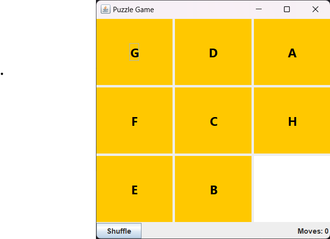

# PuzzelMVC

## Description

A simple shuffle puzzle game in java using MVC design pattern.

Model von view trennen und controller von view, da buttons und frameworks noch sich beispielsweise ändern können einfach mit int arbeiten, also bitte trenne die Komponenten besser, bitte aucheventuell det get char in view arbeiten und und bei model eher ints benutzen, damit es besser getrennt ist und modular erstztbar mit einem and make the controller dont user getClientProperty, so its better replaceable with differnt ui etc. so its MVC comform